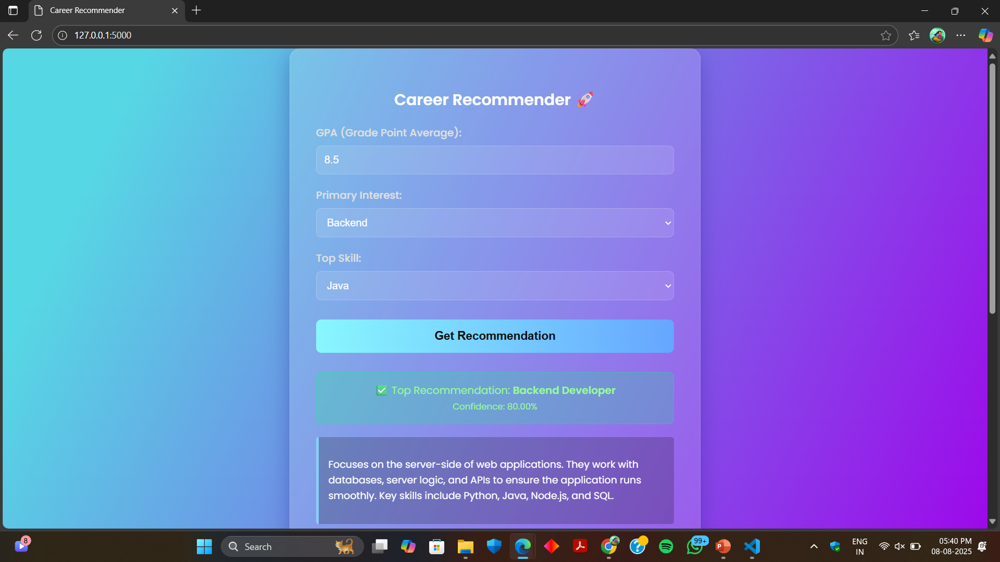
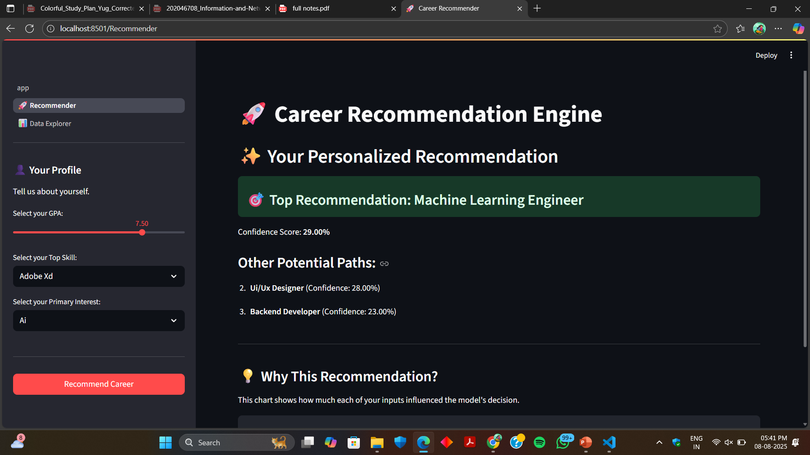

# 🤖 AI Career Recommender System

A comprehensive, end-to-end machine learning project that recommends a suitable career path based on a user's GPA, skills, and interests. The system features a robust Scikit-learn backend and offers three distinct, modern user interfaces: a Flask web app, a Streamlit dashboard, and an interactive command-line tool.

---

## 📸 Screenshots

---

## 🚀 Key Features

* **Accurate Prediction Model:** Utilizes a `RandomForestClassifier` trained on a custom dataset, achieving over 95% accuracy. The training pipeline includes robust data cleaning and evaluation.
* **Three Dynamic Interfaces:**
    * **Flask Web App:** A stunning, multi-page web application featuring a "Glassmorphism" UI with fluid animations.
    * **Streamlit Dashboard:** A professional multi-page dashboard for a rich, interactive user experience.
    * **Interactive CLI:** A polished command-line interface built with `Rich` and `Questionary` for a guided, user-friendly experience directly in the terminal.
* **Explainable AI (XAI):** Both the Flask and Streamlit apps provide not just a prediction, but also the top 3 recommendations with confidence scores and a feature importance chart to explain *why* a decision was made.
* **Interactive Data Exploration:** Both web apps include a "Data Explorer" page with visualizations and the raw dataset, providing transparency into the model's training data.

---

## 🛠️ Tech Stack

* **Backend & Machine Learning:** Python, Scikit-learn, Pandas, NumPy, Joblib
* **Flask Web App:** Flask, Matplotlib, Seaborn
* **Streamlit Dashboard:** Streamlit, Plotly
* **Command-Line Interface (CLI):** Rich, Questionary
* **Utilities:** Pyfiglet

---

## 📂 Project Structure

The project is organized into a clean and scalable structure:

├── dataset/              # Contains the raw CSV data
├── model/                # Stores the trained model (.pkl) and encoders
├── pages/                # Contains the pages for the Streamlit multi-page app
├── static/               # Serves static files (images) for the Flask app
├── templates/            # Contains HTML templates for the Flask app
├── app.py                # Main script for the Flask application
├── streamlit_app.py      # Main script for the Streamlit application
├── predict_career.py     # Script for the interactive CLI
├── train_model.py        # Script for data preprocessing, model training, and evaluation
└── requirements.txt      # Lists all project dependencies

---

## ⚙️ Setup and Installation

Follow these steps to set up and run the project locally.

#### 1. Clone the Repository

git clone [https://github.com/yugjasoliya08/Career-Recommender-System](https://github.com/yugjasoliya08/Career-Recommender-System)
cd career-recommender-system

### 2. Create and Activate a Virtual Environment
# Create the environment
python -m venv venv

# Activate on Windows
.\venv\Scripts\activate

# Activate on macOS/Linux
source venv/bin/activate

### 3. Install Dependencies

All required libraries are listed in the requirements.txt file. Install them with a single command:

pip install -r requirements.txt

##  Usage
### 1. Train the Model
Before running any of the applications, you must first train the model. This script will clean the data, train the RandomForestClassifier, and save the necessary model files in the model/ directory.

python train_model.py

### 2. Run an Application (Choose One)

--- To run the Flask Web App:

flask --app app run
Then, open your web browser to http://122.0.0.1:5000.   

--- To run the Streamlit Dashboard:

streamlit run carrer_gui.py
A new tab will automatically open in your browser.

--- To run the Interactive CLI:

python predict_career.py
Follow the prompts directly in your terminal.

## 🔮 Future Improvements

This project provides a solid foundation, but there are many exciting ways it could be extended:

* **Gather More Data:** The model's performance on rarer career paths could be improved by collecting a larger and more balanced dataset.
* **Experiment with Advanced Models:** Implement and compare the performance of other algorithms like Gradient Boosting (XGBoost) or simple Neural Networks.
* **User Accounts & History:** Add a database (e.g., SQLite) to allow users to create accounts, save their results, and track their recommendation history over time.
* **Deployment:** Add instructions and scripts for deploying the Flask or Streamlit application to a cloud platform like Vercel, Heroku, or AWS.

---

## 🙏 Acknowledgements

* This project was made possible by the incredible open-source libraries in the Python ecosystem, especially **Scikit-learn**, **Flask**, and **Streamlit**.
* A special thanks to the creators of **Rich**, **Questionary**, and **Plotly** for making it possible to build beautiful and intuitive interfaces.

---

## 📬 Contact

Yug Jasolilya – [yugjasoliya49@gmail.com]

Project Link: [https://github.com/yugjasoliya08/Career-Recommender-System](https://github.com/yugjasoliya08/Career-Recommender-System)

